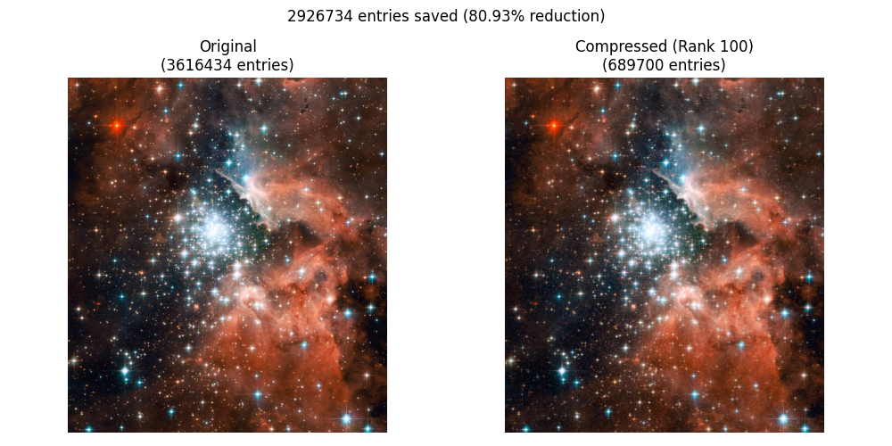

# Image Compression

This project explores how to compress images using the Singular Value Decomposition (SVD). The core idea is to represent an image—either grayscale or color—in terms of its dominant singular values and corresponding singular vectors, effectively reducing the dimensionality and thus the storage size. Each color channel can be decomposed separately, then reconstructed with a truncated set of singular values to preserve most of the visual content. By comparing the original and compressed images side by side and calculating the number of entries saved, we gain insight into the balance between data reduction and image quality. This demonstrate the power of low-rank approximations in image compression.

### Usage

```python
from image_compressor import ImageCompressor
compressor = ImageCompressor("hubble.jpg")
compressor.compress_image(20)
```


